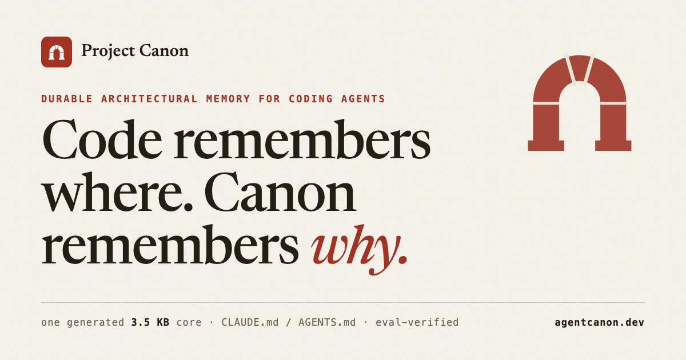

<div align="center">

# Project Canon

**Compact architectural laws and product invariants for coding agents.**

*Code remembers where. Canon remembers why.*


[](https://agentcanon.dev)

<a href="https://agentcanon.dev">
  
</a>

</div>

Every fresh agent session rebuilds its picture of your system from code
alone — and code cannot say why the system is shaped this way. The cap
that is a product promise, the gateway rule that ended an outage, the
decision that was argued for a week and settled: none of it survives
compilation, so each session re-derives what it can and guesses the rest.

Project Canon gives repository-scoped coding agents a small, durable
record of the rules that must survive implementation churn:

> Canon explains why the system is shaped this way and what must remain true.
> Code, schemas, package manifests, build graphs, and generated reports explain
> where the implementation currently lives.

Canon is not a manually synchronized mirror of the repository. File moves,
renames, helper extraction, test refactors, and new instances of an established
pattern should normally produce `Canon impact: none`.

## What you get

- **One generated contract, ~3.5 KB** — drops in as `CLAUDE.md` or
  `AGENTS.md`; no framework, nothing to build in your repo.
- **A five-part `canon/` convention** — manifest-routed, so a session loads
  the one or two pages a task needs instead of the whole record.
- **A three-way impact gate** — every change is classified none /
  clarification / change, so the record cannot rot into a changelog.
- **`canon-doctor`** — dependency-free Python validation of structure, front
  matter, routes, links, validation paths, size caps, and decision
  immutability.
- **An open evaluation lab** — ten scenarios, two independent scores per
  run, and an adoption ledger that records rejections as well as wins.

## Quick start

This installs the generated integration into a repository that does not
already have one. For managed merges, upgrades, rollback, or uninstall, use
[INSTALL.md](INSTALL.md).

```sh
git clone --depth 1 https://github.com/stefan-vatov/canon
cp canon/dist/CLAUDE.md CLAUDE.md   # Codex / Pi: cp canon/dist/AGENTS.md AGENTS.md
```

Then bootstrap the record in a fresh agent session from the target
repository:

```text
Set up Project Canon in this repository. Preserve all existing instructions.
Create canon/manifest.md with status: reference and canon/standards.md with
status: normative. Create canon/architecture/, canon/decisions/, and
canon/scratch/, and add canon/scratch/ to the repository-root .gitignore.
Do not invent standards, decisions, architecture, rationale, or domain terms.
Do not create source-file inventories or sources/verified metadata. Report
anything that still needs human input.
```

And verify:

```sh
uv run --script canon/tools/canon-doctor.py --root . --strict
```

Exit `0` means the structure, metadata, normative routes, links, validation
references, scratch boundary, and size limits pass. The record starts empty
on purpose: standards and decisions enter it only when a human states them.

<details>
<summary><b>Verified install</b> — refuses to overwrite an existing file and
checks that the generated artifacts are fresh</summary>

Replace both paths:

```sh
CANON="$(git -C /absolute/path/to/canon rev-parse --show-toplevel)" || exit 1
TARGET="$(git -C /absolute/path/to/target-repository rev-parse --show-toplevel)" || exit 1
export CANON TARGET

(
  set -eu
  test -f "$CANON/dist/AGENTS.md"
  test -z "$(git -C "$CANON" status --porcelain --untracked-files=all)"
  uv run --script "$CANON/tools/build.py" >/dev/null
  test -z "$(git -C "$CANON" status --porcelain --untracked-files=all)" || {
    echo "generated Canon artifacts were stale" >&2
    exit 1
  }
  CANON_REF="$(git -C "$CANON" rev-parse HEAD)"
  if test -e "$TARGET/AGENTS.md" || test -L "$TARGET/AGENTS.md"; then
    echo "refusing existing target: $TARGET/AGENTS.md" >&2
    exit 1
  fi
  cp "$CANON/dist/AGENTS.md" "$TARGET/AGENTS.md"
  cmp -s "$CANON/dist/AGENTS.md" "$TARGET/AGENTS.md"
  printf 'Record installed Canon revision: %s\n' "$CANON_REF"
)
```

The block refuses to overwrite an existing instruction file. Follow the
managed-merge procedure in [INSTALL.md](INSTALL.md) when one already exists.

</details>

## What Canon owns

Canon is authoritative for:

- package ownership and dependency direction;
- public contract and user-visible behavior;
- persistence, migration, retry, timeout, interruption, and lifecycle policy;
- security, privacy, and platform guarantees;
- required validation at risky boundaries;
- explicit architectural decisions and supplied rationale.

Canon does not maintain:

- source-file, export, class, helper, schema, or test inventories;
- current file locations, line numbers, barrel contents, or test shards;
- temporary migration status or completed-work summaries;
- facts already expressed by types, manifests, schemas, build graphs, or
  generated reports.

Documentation states the requirement. Tests and policy checks prove it. Code
supplies the implementation.

## Canon impact

Every implementation change gets one classification:

| Classification | Meaning | Canon action |
|---|---|---|
| No impact | Guarantees, ownership, contracts, and validation stay unchanged | Do not edit Canon |
| Clarification | The intended rule is unchanged but materially ambiguous | Clarify the owning rule |
| Change | A durable guarantee, boundary, behavior, risk policy, or required check changes | Update the smallest owning page |

Before editing Canon, finish: `Canon changed because the system must now
guarantee that ...`. If the reason is only that a file or symbol moved, leave
Canon alone.

When a guarantee changes, record its complete durable contract: supplied
boundaries, invalid cases, error behavior, numeric limits, exceptions, and
negations. When a required policy is absent, report the gap instead of
guessing, implementing, testing, or canonizing a value.

## Repository Canon shape

```text
canon/
    manifest.md          # compact concern-to-page router
    standards.md         # project-wide architectural laws
    architecture/        # focused subsystem and product invariants
    decisions/           # immutable explicit human decisions
    scratch/             # ignored, temporary, non-authoritative work
```

Only `manifest.md` and `standards.md` are required files. Canon grows when a
durable invariant needs an owner, not whenever the source tree grows.

Every new permanent page uses compact metadata:

```yaml
---
status: normative
scope:
  - "@example/persistence"
validation:
  - tests/architecture/test_dependency_policy.py
related:
  - ./runtime-services.md
---
```

`status` is `normative`, `reference`, `draft`, or `deprecated`. Normative pages
must be routed from the manifest. Legacy `sources` lists and `verified` commit
hashes are rejected: they created documentation churn without proving truth.
Validation entries name existing regular, non-symlink files with
repository-root-relative paths, never paths relative to the Canon page.
Successor decisions use `supersedes` as a non-empty list of local predecessor
decision paths, while current-state architecture pages state the active rule
or value explicitly. Predecessors remain manifest-routed as clearly labeled
historical decision context.

## Evidence

The core is not hand-tuned prose; it is gated by this repository's own lab:

- **Ten scenarios** drop real coding agents into seeded fixture repositories
  and apply pressure — urgency against invariants, absent-policy abstention,
  one invariant carried across ten fresh sessions, a supersession that tempts
  a history rewrite.
- **Two scores per run, reported separately**: mechanical checks (fixture
  tests, validation paths, routing, abstention — with hidden holdout tests
  run in disposable copies) and a judge scoring fifteen rubric criteria from
  the distilled transcript, the diff, and the final Canon.
- **The current 3,511-byte core** (36% of its 9,789-byte predecessor) was
  adopted after a same-wave three-arm comparison across seven model lanes
  and 70 judged batches.
- **[BASELINES.md](evals/BASELINES.md) records rejections too** — an
  apparent win traced to cross-batch variance is kept as a rejection, and
  weak-tier failures stand as negative baselines rather than excuses.

The harness, scenarios, rubric, and playbook are all in
[evals/](evals/README.md).

## What Canon is not

- **Not a wiki, not a mirror.** Inventories, file locations, and migration
  status are rejected by design — the doctor's smell tests flag them —
  because the repository already proves those facts and prose copies rot.
- **It will not write itself.** Bootstrap creates an empty shape and invents
  nothing; filling it is the human's job.
- **Not zero-tooling.** The artifacts are plain Markdown, but the validator
  and build tooling run via [`uv`](https://docs.astral.sh/uv/) (Python 3.10+).
- **Not a guarantee.** Adherence is measured per model and recorded, not
  assumed — which is why the lab and its ledger are public.

## Supported integrations

| Agent or harness | Source | Default destination |
|---|---|---|
| Codex, Pi, or another `AGENTS.md` reader | `dist/AGENTS.md` | `AGENTS.md` |
| Claude Code | `dist/CLAUDE.md` | `CLAUDE.md` |

Both artifacts contain the same generated Canon contract. Pi 0.83 and later
loads a project `AGENTS.md` natively, so Pi consumes the `AGENTS.md`
integration with no Pi-specific file.

## Normal agent workflow

The installed guidance directs an agent to:

1. read `canon/manifest.md` and only the relevant routed pages;
2. exclude `canon/scratch/` from normal context;
3. identify applicable invariants and validation;
4. implement and test the requested work;
5. classify Canon impact and edit Canon only for a clarification or change;
6. report `Canon impact: none` or the exact invariant updated.

The manifest is a router, not a catalog. Each route has exactly one local
Markdown link and an explicit, non-empty `read when ...` or `read for ...`
condition. A well-routed agent should usually load one or two Canon pages,
while loading any additional routed authority that jointly governs the task
instead of treating the usual count as a cap.

## Validate and compact

The doctor is dependency-free Python:

```sh
uv run --script tools/canon-doctor.py --root /absolute/path/to/target
uv run --script tools/canon-doctor.py --root /absolute/path/to/target --json
uv run --script tools/canon-doctor.py --root /absolute/path/to/target --strict
uv run --script tools/canon-doctor.py --root /absolute/path/to/target \
  --baseline <trusted-pre-migration-commit> --strict
```

Without `--baseline`, existing decisions are still checked against `HEAD` for
byte immutability, but historical records with invalid metadata, stale
links, or oversize bodies are not grandfathered.
Supply `--baseline` only with the reviewed commit recorded before migrating a
legacy Canon; keep that commit pinned in subsequent validation.

Use [`$compact-canon`](.codex/skills/compact-canon/SKILL.md) for an on-demand
audit or migration of an overgrown Canon. It identifies repeated rules,
implementation inventories, legacy metadata, routing gaps, and reconstructible
prose while preserving human standards and immutable decisions. Ask for a
`dry run` to receive candidates without changing files.

## Maintain this repository

`canon-core.md` is the source of both generated agent artifacts under `dist/`:
`dist/CLAUDE.md` and `dist/AGENTS.md`. After changing the core:

```sh
uv run --script tools/build.py
uv run --script tools/build.py
PYTHONDONTWRITEBYTECODE=1 \
  uv run python -m unittest discover -s tests -p 'test_*.py' -v
git diff --check
```

The second build must report both artifacts as `fresh`.

The website is maintained from this repository too: `npm install` once,
`npm run dev` to preview, `npm run build` to build into `dist-site/` (never
`dist/`, which holds the generated artifacts), and `npx wrangler deploy` to
publish — the last one requires Cloudflare access to the agentcanon.dev
zone.

## Website

[agentcanon.dev](https://agentcanon.dev) — the whole argument, walked: why
sessions lose the why, what the record owns and refuses, the impact gate,
the discipline under conflict and absence, the evaluation evidence, and
installation.

## Documentation

- [INSTALL.md](INSTALL.md) — safe installation, merge, upgrade, rollback, and
  uninstall procedures.
- [canon-core.md](canon-core.md) — exact shared agent contract.
- [evals/README.md](evals/README.md) — evaluation harness and scenarios.
- [evals/PLAYBOOK.md](evals/PLAYBOOK.md) — improvement and adoption runbook.
- [evals/BASELINES.md](evals/BASELINES.md) — compact evaluation adoption ledger.

Project Canon is MIT licensed and originated as a fork of
[fjzeit's concept](https://github.com/fjzeit/lode).

---

**Companion project:** [Agent Constitution](https://agentconstitution.dev)
([repo](https://github.com/stefan-vatov/agentconstitution)) — the law your
agents build under, where Canon is the record they build on. The two share
one visual language and complementary jobs: the constitution governs
direction and values; Canon keeps the architectural invariants and the
reasons behind them.
